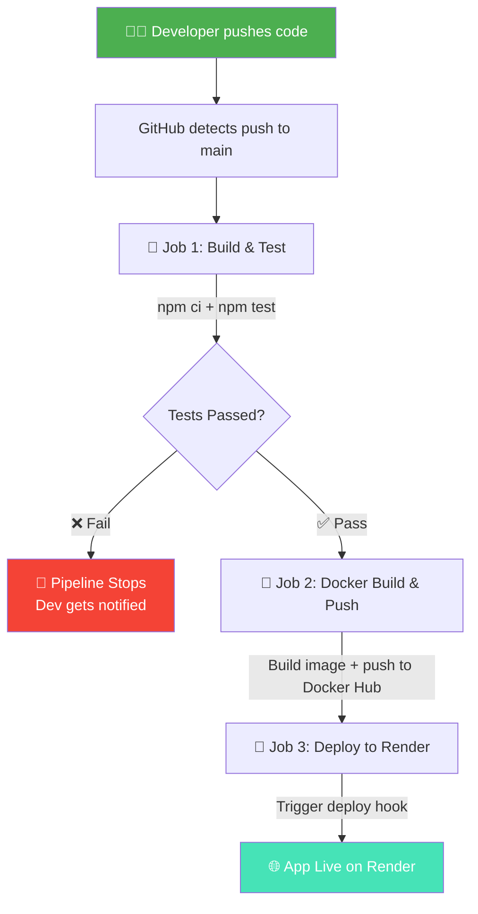

readme_content = """# 🚀 Node.js CI/CD Pipeline


> A fully automated CI/CD pipeline that builds, tests, containerizes, and deploys a Node.js web application on every push to `main` — with zero manual intervention.

---

## 🔄 Pipeline Flow



---

## 📌 Project Overview

This project demonstrates end-to-end **DevOps automation** using GitHub Actions, Docker, and Render. Every code push triggers a 3-stage pipeline:

- ✅ **Continuous Integration** — auto build and test on every push
- ✅ **Containerization** — Docker image built and pushed to registry
- ✅ **Continuous Deployment** — auto deploy to cloud on every successful build

---

## 🛠️ Tech Stack

| Tool | Purpose |
|------|---------|
|  | Web application runtime |
|  | CI/CD pipeline automation |
|  | Containerization |
|  | Container image registry |
|  | Cloud deployment platform |

---

## 📁 Project Structure

```
node-cicd-pipeline/
├── .github/
│   └── workflows/
│       └── main.yml        # ⚙️ GitHub Actions CI/CD workflow
├── Dockerfile              # 🐳 Docker container configuration
├── server.js               # 🟢 Main Node.js application
├── package.json            # 📦 Dependencies and scripts
└── README.md               # 📄 Project documentation
```

---

## ⚙️ GitHub Actions Workflow

### 🧪 Job 1 — Build & Test
```yaml
- Checkout code
- Setup Node.js 20
- npm ci              # clean install
- npm test            # run test suite
```

### 🐳 Job 2 — Docker Build & Push
```yaml
- Setup Docker Buildx
- Login to Docker Hub
- Build Docker image
- Push image → Docker Hub as :latest
```

### 🚀 Job 3 — Deploy to Render
```yaml
- Trigger Render deploy hook (HTTP POST)
- Render pulls latest Docker image
- App redeployed automatically
```

---

## 🐳 Run Locally with Docker

```bash
# Clone the repo
git clone https://github.com/TrisHa0510/node-cicd-pipeline.git
cd node-cicd-pipeline

# Build Docker image
docker build -t node-cicd-pipeline .

# Run container
docker run -p 3000:3000 node-cicd-pipeline
```

🌐 App runs at: `http://localhost:3000`

---

## 🔐 GitHub Secrets Required

> Go to **Repo → Settings → Secrets and Variables → Actions**

| Secret Name | Description |
|-------------|-------------|
| `DOCKERHUB_USERNAME` | Your Docker Hub username |
| `DOCKERHUB_TOKEN` | Your Docker Hub access token |
| `RENDER_DEPLOY_HOOK` | Your Render service deploy hook URL |

---

## 🚀 Getting Started (Without Docker)

```bash
# Clone the repository
git clone https://github.com/TrisHa0510/node-cicd-pipeline.git

# Install dependencies
cd node-cicd-pipeline
npm install

# Start the app
node server.js
```

---

## 📸 Pipeline in Action

> ✅ GitHub Actions — All jobs passing

<!-- Add screenshot of GitHub Actions green pipeline here -->
<!-- Example:  -->

> 🌐 App deployed live on Render

<!-- Add screenshot of running app here -->
<!-- Example:  -->

---

## 💡 Key Concepts

| Concept | Explanation |
|---------|-------------|
| **CI (Continuous Integration)** | Auto-build and test every code push |
| **CD (Continuous Deployment)** | Auto-deploy after every successful test |
| **Docker** | Packages app into a container — runs anywhere |
| **GitHub Secrets** | Stores credentials safely, never hardcoded |
| **Render Deploy Hook** | URL that triggers redeployment when called |

---

## 👩‍💻 Author

**Trisha Patil**
- 📧 23amtics036@gmail.com
- 🐙 [GitHub @TrisHa0510](https://github.com/TrisHa0510)

---

## 📄 License

This project is open source and available under the [MIT License](LICENSE).
"""

with open("README.md", "w", encoding="utf-8") as f:
    f.write(readme_content)

print("README.md created!")
print(f"Characters: {len(readme_content)}")
