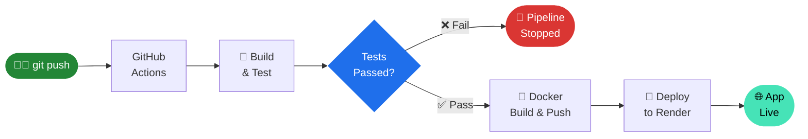

readme_content = """<div align="center">

# ⚙️ Automated Node.js CI/CD Pipeline

<p align="center">
  
  &nbsp;
  
  &nbsp;
  
  &nbsp;
  
  &nbsp;
  
</p>

<p align="center">
  <i>Push code → Tests run → Docker image built → App deployed. Automatically.</i>
</p>

</div>

---

## 📖 About

This project demonstrates a production-grade **CI/CD pipeline** using modern DevOps tools. Every push to the `main` branch automatically triggers a 3-stage pipeline — no manual steps required.

- 🔁 **Continuous Integration** — code is built and tested on every push
- 🐳 **Containerization** — Docker image is built and pushed to Docker Hub
- 🚀 **Continuous Deployment** — app is deployed to Render automatically

---

## 🔄 Pipeline Architecture



---

## 🛠️ Tech Stack

<div align="center">

| Layer | Technology | Role |
|-------|-----------|------|
| **App** | Node.js 20 + Express | Web server |
| **Pipeline** | GitHub Actions | CI/CD automation |
| **Container** | Docker + Docker Hub | Build & registry |
| **Deploy** | Render | Cloud hosting |
| **Security** | GitHub Secrets | Credential management |

</div>

---

## 📁 Project Structure

```
📦 node-cicd-pipeline
 ┣ 📂 .github
 ┃ ┗ 📂 workflows
 ┃   ┗ 📜 main.yml        ← CI/CD pipeline definition
 ┣ 📜 Dockerfile           ← Container build instructions
 ┣ 📜 server.js            ← Node.js application entry point
 ┣ 📜 package.json         ← Dependencies & npm scripts
 ┗ 📜 README.md
```

---

## 🔐 Secrets Configuration

> **Repo → Settings → Secrets and Variables → Actions → New repository secret**

| Secret | Value |
|--------|-------|
| `DOCKERHUB_USERNAME` | Your Docker Hub username |
| `DOCKERHUB_TOKEN` | Docker Hub access token (not password) |
| `RENDER_DEPLOY_HOOK` | Deploy hook URL from Render dashboard |

---

## 🐳 Run Locally

```bash
# Clone
git clone https://github.com/TrisHa0510/node-cicd-pipeline.git
cd node-cicd-pipeline

# Option 1 — Node directly
npm install && node server.js

# Option 2 — Docker
docker build -t node-cicd-pipeline .
docker run -p 3000:3000 node-cicd-pipeline
```

> App available at `http://localhost:3000`

---

## 📸 Pipeline in Action

| GitHub Actions | Deployed App |
|---|---|
| *(Add screenshot of green pipeline)* | *(Add screenshot of live app)* |

> To add screenshots: create an `assets/` folder, add `.png` files, and replace the placeholders above with ``

---

## 💡 CI/CD Concepts

| Term | Meaning |
|------|---------|
| **CI** | Auto-build and test on every code push |
| **CD** | Auto-deploy after every successful test |
| **Docker Image** | Packaged app that runs identically everywhere |
| **Deploy Hook** | A URL that triggers redeployment when called |
| **GitHub Secrets** | Encrypted storage for tokens and credentials |

---

<div align="center">

## 👩‍💻 Author

**Trisha Patil**

[](https://github.com/TrisHa0510)
[](mailto:23amtics036@gmail.com)

<br/>

*Made with ❤️ as part of a DevOps learning project*

</div>
"""

with open("README.md", "w", encoding="utf-8") as f:
    f.write(readme_content)

print("README.md created!")
